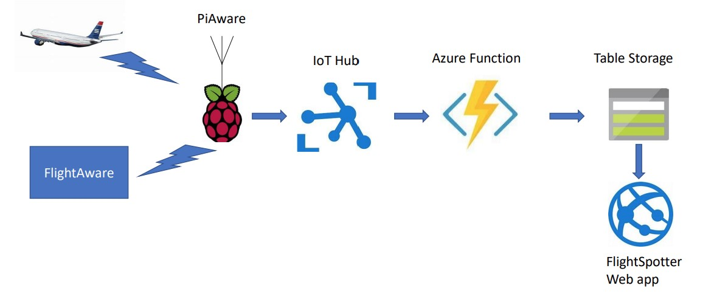

# uploadflights
A way to upload flight data from a PiAware receiver to an Azure IoT system for offline processing.

## Why?
I have a couple of Raspberry Pi based devices which can pick up ADS-B (Automatic Dependence Surveillance - Broadcast) transmissions sent out by all
modern planes.  These transmissions are sent via radio at 1090 MHz and typically contain the position, heading and altitude of the plane among other
data.  Anyone with the appropriate hardware can receive the transmissions.

The company [FlightAware](www.flightaware.com) crowd sources these transmissions from hobbyists which are then made available on their free website and
mobile app.  They have a Pi-based system (search GitHub for it) which is available to anyone to create a receiver.  The system picks up the transmissions
and sends them to FlightAware.

I wanted to know what flights my receivers had seen on a particular day.  So I wanted to save one flight record from each unique flight that my receivers see
on any particular day.  The way I did this is to tap into the small lighttpd based API that runs on the Pi.  This is normally used to serve a local web interface for watching planes, overlaid on a map, in real time.

## Motivation
I took the opportunity to learn how to run a .Net Core application on a Raspberry Pi and wrote a small program to get the flight information.  I also took
the opportunity to learn Azure IoT Hub which receives the data from the program and then invokes an Azure function to process it.  Finally, I have a small
website which displays this data in a tabular form.  So now I don't have to watch planes in real time.  At any time, I can just go to my website to see how many unique flights were seen and to find interesting ones.  For example, since I live close to Seattle, I see frequent Boeing test flights, and at times, the first delivery flights when a customer picks up their brand new plane and takes it home.  This is what the system looks like:

Recently I built a PiAware system on a Raspberry Pi Zero.  The Zero has an Arm v6 processor (as opposed to Arm v7 on the more muscular Pis).  DotNet Core
is not supported on these processors, so I had to find another way to collect and send the data.  I considered C, Node.js and Python. I quickly eliminated C as I wanted
something more high level.  Node.js was eliminated because it is also not fully supported on Arm v6 processors.  That left me with Python, which is supported - another learning
opportunity!  Fortunately Azure IoT supports a variety of high level languages on devices, including Python.  See [this](https://github.com/Azure/azure-iot-sdk-python).

## Other Learnings
Along the way, I picked up some good learning with tooling, etc.

### Visual Studio Code and WSL
I have Windows Subsystem for Linux running on my machine, with a Debian distribution (to keep it close to Raspabian).  I learnt how to use VS Code directly with WSL.
You first have to install the Visual Studio Code Remove Development Extension [pack](https://marketplace.visualstudio.com/items?itemName=ms-vscode-remote.vscode-remote-extensionpack).  Then you fire up your Debian Bash shell and navigate to the location of your project and type in "code .".  The first time you do this, it will install
a small server to allow VS Code to interact with WSL.

Using this arrangement, I am able to code using VS Code and then directly execute the code in WSL.  Of course, one can do the same running Python directly on Windows, but I wanted the Linux experience.

### Python
In WSL, Python and it's package manager can be installed by:

    sudo apt update
    sudo apt install python3 python3-pip

Next, the Python device libraries can be installed (and listed) by:

    pip3 install azure-iot-device
    pip3 list
    
### Requests library
A high level HTTP [library](https://2.python-requests.org/en/latest/) for Python. Makes writing HTTP request-response code in Python a breeze.  It has a built-in JSON decoder.

## Resources
1. Python style [guide](https://www.python.org/dev/peps/pep-0008/#comments).
1. Python [documentation](https://docs.python.org/3/)
1. Upgrade Debian from Stretch to Buster.  I used these [instructions](https://davidsmith.is/2019/07/11/updating-your-wsl-debian-image-to-buster/)

